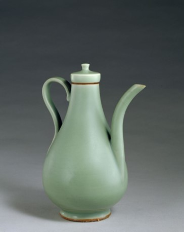

# 龙泉青瓷

**龙泉窑青瓷** 尽揽自然界的苍葱与润泽，以温润如玉的釉色，古朴端庄的造型誉满全球，成为青瓷世界一朵最绚丽的奇葩。在中国制瓷史上，龙泉窑是烧制时间最长、窑址分布最广、生产规模和外销范围最大的历史名窑。龙泉窑吸取了南北青瓷的制瓷技艺，并在“官窑”和“民窑”两个不同文化层次的相互激荡中发展，成为中国历代青瓷工艺发展的集大成者，把中国青瓷艺术推向极致。

!!!tip "Pride!"
    2006年5月20日，龙泉青瓷传统烧制技艺经国务院批准列入第一批国家级非物质文化遗产名录。

## 龙泉青瓷的历史

经考古调查，南宋中期龙泉大窑杉树连山、亭后山、溪口瓦窑垟等诸窑址中，曾发现黑胎开片标本堆积。这类瓷器专为宫廷特殊需要烧造，供皇室及宫廷御用。黑胎产品主要特征是紫口铁足，胎薄釉厚，釉面布满纹片，即`《龙泉县志》`记载的哥窑产品。相传宋代有章生一、章生二兄弟在龙泉大窑带烧制青瓷，章生二所主这窑称“弟窑”。弟窑青瓷装饰以素面厚釉为主，造型典雅。胎质有白胎、朱砂胎。釉色温润如玉、纯粹不瑕，以粉青、梅子青釉为杰出代表，体现了中国传统的审美情趣，成为中国青瓷的典范。哥窑青瓷以黑胎开片著称，其特征为:黑胎、紫口铁足、釉面开片、釉色浓淡不一。随着考古发掘的不断推进，对哥窑的认识已渐趋清晰，哥窑即为龙泉地区所产的黑胎青瓷。

!!!note "哥窑与弟窑"
    龙泉青瓷分黑胎开片和白胎青釉两类，即传统所说的哥窑与弟窑。

**龙泉青瓷** 始烧于三国两晋，距今1600多年的历史。五代前属初创时期，产品缺乏自身特点。北宋已初具规模，龙泉窑风格突显，南宋和元代为鼎盛时期，明代规模不减，清代逐渐衰落，但未停烧。南宋和元代这一鼎盛时期，制瓷技艺登峰造极，形成了一个以龙泉为中心，向四面八方辐射、窑场众多、范围很广的瓷窑体系，经考古调查发现古窑址500多处，其中龙泉境内390多处。出现了“瓯江两岸瓷窑林立烟火相望，江上运瓷船舶来往如织”的繁荣景象，龙泉成为中国的瓷都。

## 龙泉青瓷的制作工艺

**龙泉青瓷** 的制作由配料、成型、修坯、装饰、施釉和素烧、装匣、装窑、烧成九个环节组成，其中施釉和素烧两个环节独具匠心，成为龙泉青瓷鹤立于众青瓷的关键步骤。施釉可分为荡釉、浸釉、涂釉、喷釉等几个步骤。厚釉类产品通常要施釉数层，施一层素烧一次，再施釉再素烧，如此反复四五次方可，最多者要施釉十层以上，然后才进入正烧；素烧温度比较低，一般在摄氏800度左右。而釉烧则在摄氏1200度左右，按要求逐步升温、控温，控制窑内气氛，最后烧成成品。南宋至元代前期，龙泉窑曾烧制薄胎原釉器物，施一层釉烧一次，最厚可达十余层。经过施釉和素烧两个步骤，龙泉青瓷呈现出“青翠欲滴，温润如玉”的釉色，堪称一绝。

!!!abstract
    龙泉青瓷凭借着其厚重的历史和绝伦的成色，形成无可比拟的魅力。尽管曾经衰落，但是承载着龙泉劳动人民心血和智慧的龙泉青瓷在如今俨然恢复了往日的荣光，享名四海，成为龙泉乃至浙江省的一张耀眼名片。
